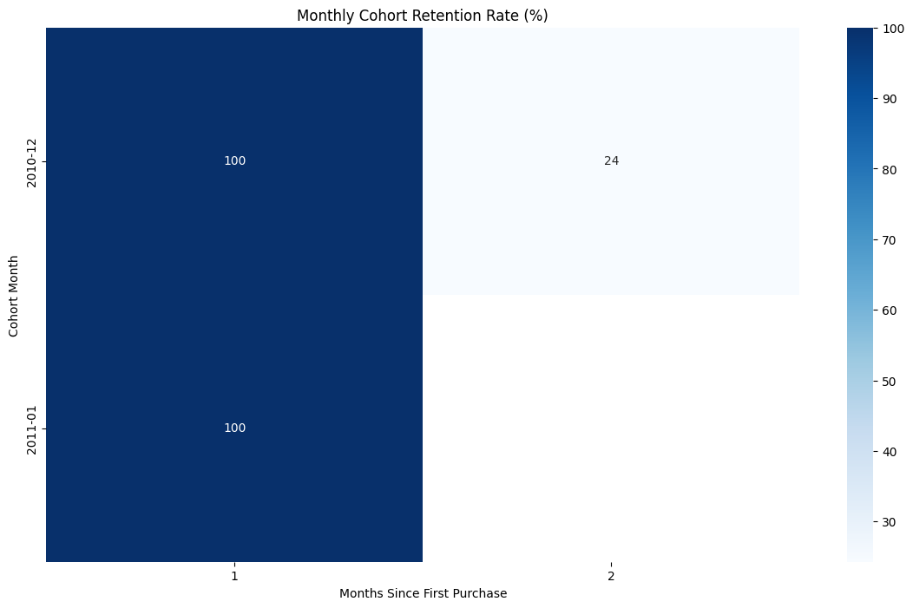

# Cohort Retention Analysis — Online Retail Dataset

## Objective
Analyze customer retention patterns using cohort analysis on transactional 
data from a UK-based online retailer (Dec 2010 – Dec 2011).

## Tools Used
- Python (pandas, matplotlib, seaborn)
- SQL (MySQL) for cross-validation of grouping logic

## Method
1. Cleaned raw transaction data (removed nulls, duplicates, returns)
2. Assigned each customer a cohort based on their first purchase month
3. Calculated "months since first purchase" (CohortIndex) for every transaction
4. Built a pivot table of unique active customers per cohort per month
5. Converted counts into retention percentages
6. Visualized results as a heatmap

## Key Insight
Retention drops sharply after the first month across nearly all cohorts, 
falling to roughly 20–30% by month 2, and continues to decline gradually 
in later months. This suggests most customers make a single purchase and 
don't return, while a smaller core group continues buying repeatedly over 
many months.

## Output

